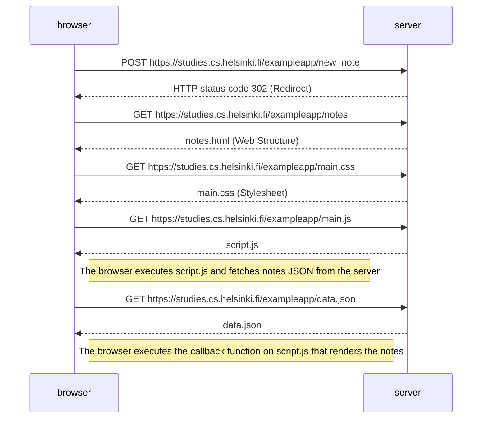

```mermaid
sequenceDiagram
    participant browser
    participant server

    browser->>server: POST https://studies.cs.helsinki.fi/exampleapp/new_note
    server-->>browser: HTTP status code 302 (Redirect)

    browser->>server: GET https://studies.cs.helsinki.fi/exampleapp/notes
    server-->>browser: notes.html (Web Structure)

    browser->>server: GET https://studies.cs.helsinki.fi/exampleapp/main.css
    server-->>browser: main.css (Stylesheet)

    browser->>server: GET https://studies.cs.helsinki.fi/exampleapp/main.js
    server-->>browser: script.js

    Note right of browser: The browser executes script.js and fetches notes JSON from the server

    browser->>server: GET https://studies.cs.helsinki.fi/exampleapp/data.json
    server-->>browser: data.json

    Note right of browser: The browser executes the callback function on script.js that renders the notes
```